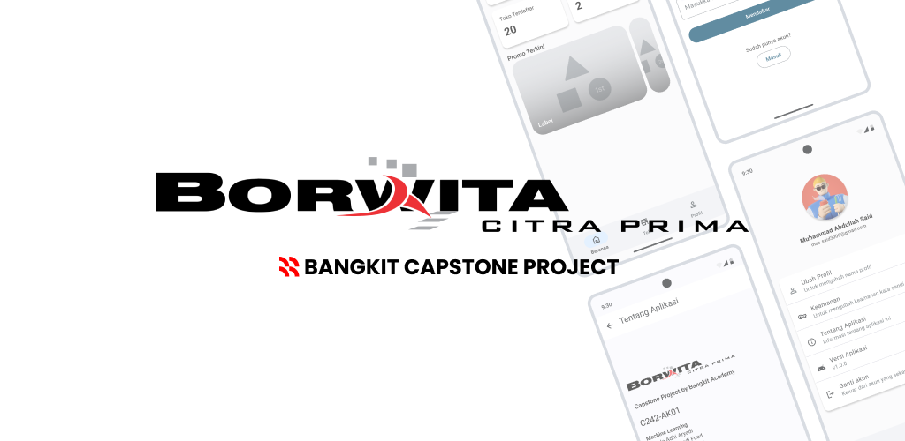
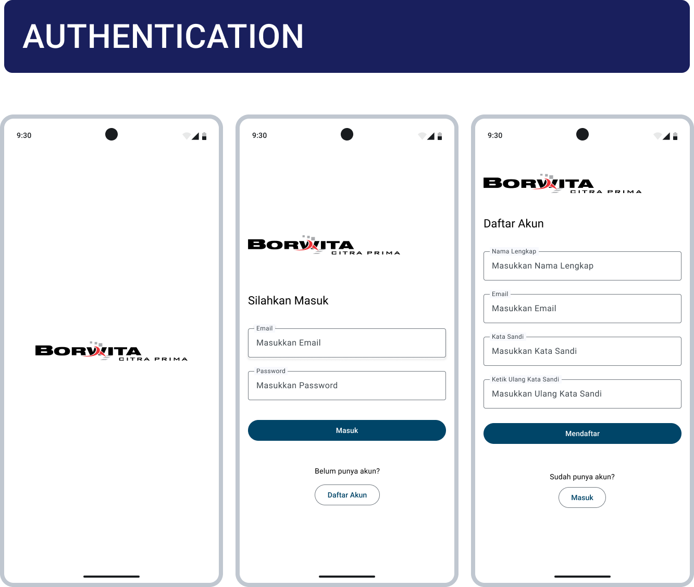
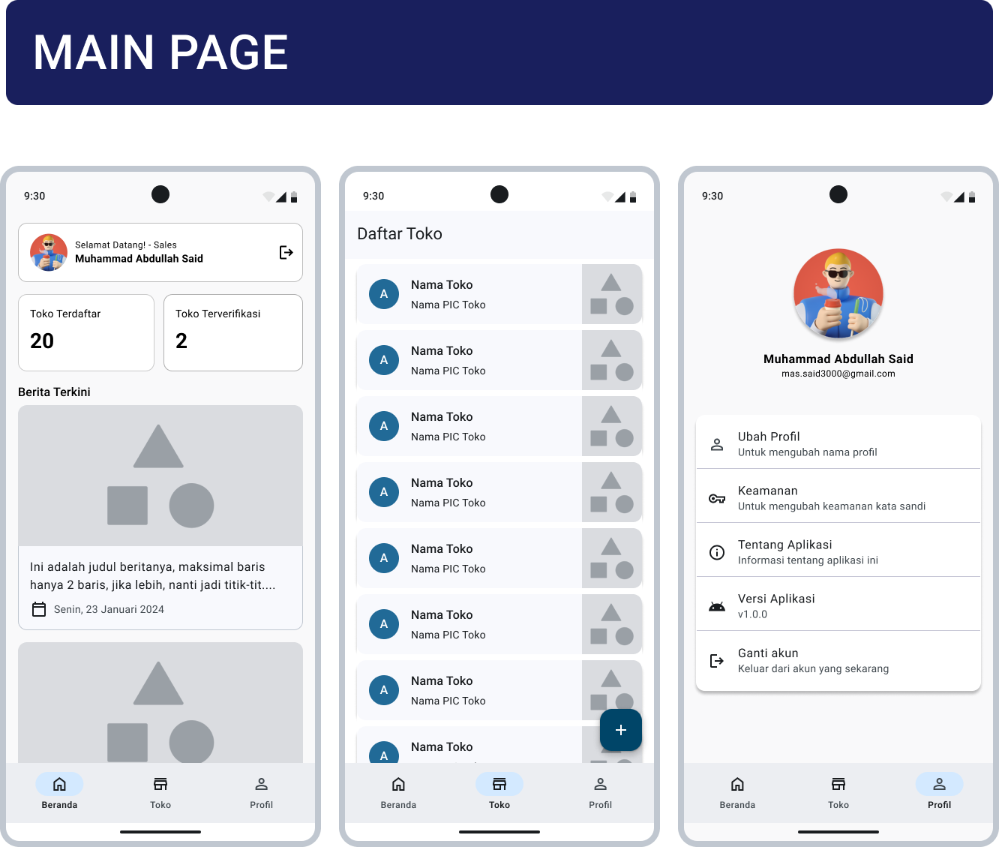
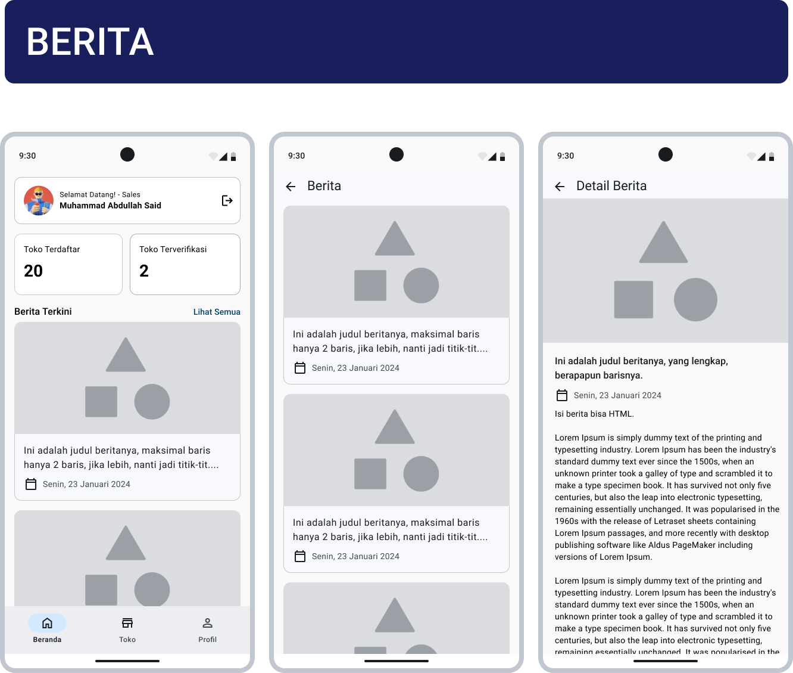
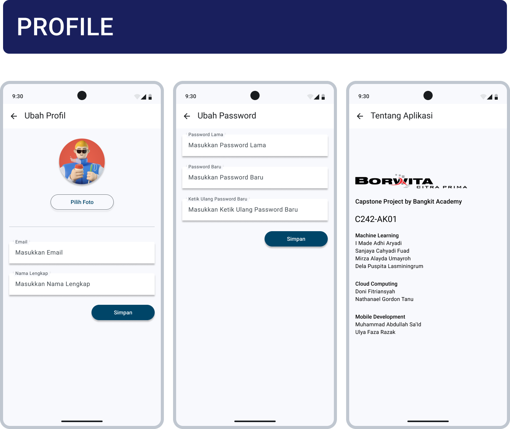
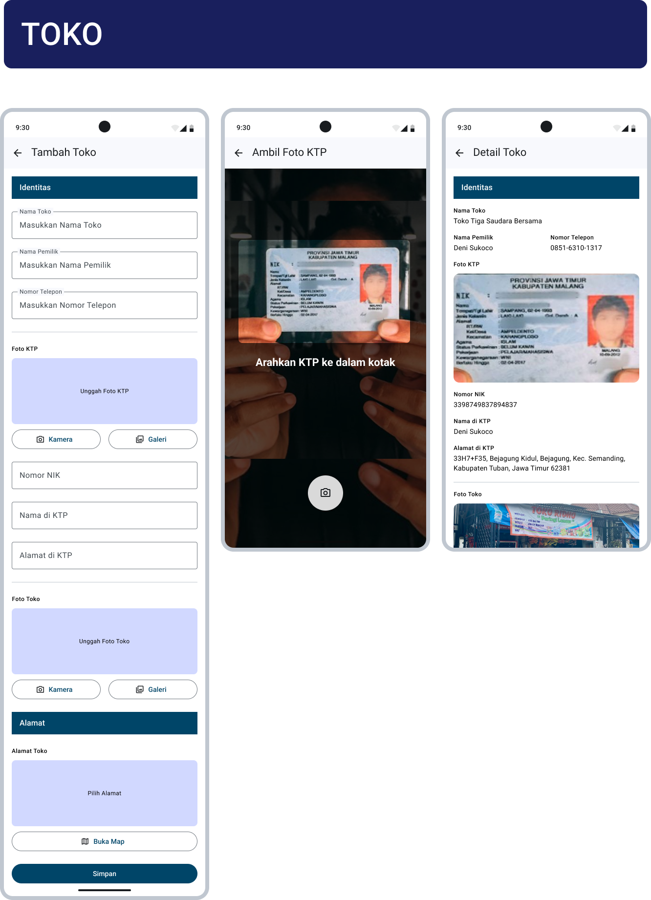

# Mobile Development - Borwita

<p align="justify"> A mobile application that updates existing applications and makes several improvements in the form of design and OCR systems for detecting ID cards. This is our Bangkit Academy 2024 Batch 2 capstone project. And this is also a requirement for our graduation from the Bangkit Academy 2024 Batch 2 Program as an Android Learning Path.</p>

### Architecture

- **XML** to specify the layout of activities or parts of the user interface (UI).
- Appealing design system with pre-designed UI using [Material3](https://m3.material.io/).
- Using [ViewModel](https://developer.android.com/topic/libraries/architecture/viewmodel) to store and manage UI-related data.
- A SQL database.
- Abstract the data sources from the rest of the application using Repository.
- [Retrofit](https://square.github.io/retrofit/) to make requests to server APIs and handle their responses.
- Manage image processing, caching, and handle various image formats using [Glide](https://github.com/bumptech/glide).
- Dependency injection.

## Opening This Project

These instructions will guide you through the process of setting up and running the Mobile Development project.

Clone the repository:
```bash
git clone git@github.com:Capstone-Borwita/mobile-development-path.git
```

Navigate to the project directory:
```bash
cd mobile-development-path
```

Finally, open the Borwita Capstone directory in Android Studio.

## Screenshots








